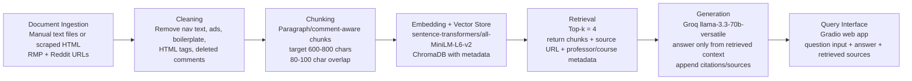

# Project 1 Planning: The Unofficial Guide

> Write this document before you write any pipeline code.
> Your spec and architecture diagram are what you'll use to direct AI tools (Claude, Copilot, etc.) to generate your implementation — the more specific they are, the more useful the generated code will be.
> Update the Retrieval Approach and Chunking Strategy sections if you change your approach during implementation.
> Update this file before starting any stretch features.

---

## Domain

<!-- What domain did you choose? Why is this knowledge valuable and hard to find through official channels? -->
**Student reviews of Computer Science professors and courses at University of Minnesota.** This knowledge is valuable because official course catalogs only provide generic descriptions and grading weightings. They don't tell students the "real" survival knowledge: whether a professor actually curves exams, if the textbook is useless, or if a specific TA grades much harder than others. This information usually lives in scattered, hard-to-search Reddit threads, Rate My Professors pages, and private Discord servers.
---

## Documents

<!-- List your specific sources: URLs, subreddit names, forum threads, or file descriptions.
     Aim for at least 10 sources that together cover different subtopics or perspectives within your domain. -->

| # | Source | Description | URL or location |
|---|--------|-------------|-----------------|
| 1 | Rate My Professors |  Review of Professor Jack Kolb | https://www.ratemyprofessors.com/rating/43184294?utm_source=share&utm_medium=web&utm_campaign=prof_rating |
| 2 | Rate My Professors | Review of Professor Daniel Kluver | https://www.ratemyprofessors.com/rating/42395301?utm_source=share&utm_medium=web&utm_campaign=prof_rating |
| 3 | Rate My Professors | Review of Professor Kevin Wendt | https://www.ratemyprofessors.com/rating/39954983?utm_source=share&utm_medium=web&utm_campaign=prof_rating |
| 4 | Rate My Professors | Review of Professor Maria Gini | https://www.ratemyprofessors.com/rating/41073960?utm_source=share&utm_medium=web&utm_campaign=prof_rating |
| 5 | Rate My Professors | Review of Professor Adriana Picoral | https://www.ratemyprofessors.com/rating/43017041?utm_source=share&utm_medium=web&utm_campaign=prof_rating |
| 6 | Reddit | CSCI 2011 w/ Sebastiaan Joosten | https://www.reddit.com/r/uofmn/comments/18tplvc/csci_2011_w_sebastiaan_joosten/ |
| 7 | Reddit | CSCI 2021: Thoughts on Kauffman? | https://www.reddit.com/r/uofmn/comments/jcdeya/csci_2021_thoughts_on_kauffman/ |
| 8 | Reddit | Prof Recommendations for CSCI classes | https://www.reddit.com/r/uofmn/comments/juyehz/prof_recommendations_for_csci_classes/ |
| 9 | Reddit | How bad is timothy wrenn for CSCI 3081W? | https://www.reddit.com/r/uofmn/comments/g4nfqj/how_bad_is_timothy_wrenn_for_csci_3081w/ |
| 10 | Reddit | CSCI 2041 | https://www.reddit.com/r/uofmn/comments/u2nqg4/csci_2041/ |

---

## Chunking Strategy

<!-- How will you split documents into chunks?
     State your chunk size (in tokens or characters), overlap size, and explain why those
     numbers fit the structure of your documents.
     A review-heavy corpus warrants different chunking than a long FAQ. -->

**Chunk size:** 600–800 characters, using paragraph/comment boundaries when possible.

**Overlap:** 80–100 characters.

**Reasoning:** The documents are mostly short Rate My Professors reviews and Reddit comments. I will keep each individual review or Reddit comment together when possible because one comment usually contains a complete opinion about a professor, course, workload, grading, or attendance. For longer Reddit comments, I will split them into 600–800 character chunks with 80–100 characters of overlap so that professor names, course numbers, and the reason for the opinion stay together. This should reduce the risk of retrieving fragments that mention a professor without the actual recommendation or warning.
---

## Retrieval Approach

<!-- Which embedding model are you using (e.g., all-MiniLM-L6-v2 via sentence-transformers)?
     How many chunks will you retrieve per query (top-k)?
     If you were deploying this for real users and cost wasn't a constraint, what tradeoffs
     would you weigh in choosing a different embedding model — context length, multilingual
     support, accuracy on domain-specific text, latency? -->

**Embedding model:** `sentence-transformers/all-MiniLM-L6-v2`

**Top-k:** 4

**Production tradeoff reflection:** While `all-MiniLM-L6-v2` is free, runs locally, and has near-zero latency, its context window is limited and it can struggle with nuanced slang or complex multilingual queries. An API-based model like OpenAI's would increase latency and cost money per query, but it would provide much better semantic matching for varied, messy student language and support longer context windows if we decide to ingest full course syllabi later.
 
---

## Evaluation Plan

<!-- List your 5 test questions with their expected correct answers.
     Questions should be specific enough that you can judge whether the system's response
     is right or wrong. "What are good dining halls?" is too vague.
     "What do students say about wait times at [dining hall name] during lunch?" is testable. -->

| # | Question | Expected answer |
|---|----------|-----------------|
| 1 | What does the review say are the main workload challenges in Jack Kolb’s CSCI5103? | The answer should say that labs and homework are the main time sinks. They are described as difficult and time-consuming but rewarding. The review also says there is one midterm and one final, but they are not too difficult. |
| 2 | Why does the Maria Gini review say students need to read the textbook for CSCI4511W? | The answer should say that Gini knows the subject and is nice, but students need to read because exams include questions from the textbook that are not taught in lecture. It should also mention that practice exam answer keys are not provided and the project is fairly unguided. |
| 3 | How does the final work in Sebastiaan Joosten’s CSCI2011, according to the Reddit thread? | The answer should say that there is a final, but it works as a re-sit or do-over for midterms that students missed or want to improve. The final can count as a large part of the grade if used to replace many midterms, or as 0% if the student is satisfied with their midterm grades. The answer may also mention that attendance had at least some mandatory component. |
| 4 | Why do students recommend Kauffman for CSCI2021? | The answer should say that students describe Kauffman as one of the best CS/CSE professors, caring, motivating, responsive to feedback, and helpful. It should also mention the engagement point system where students could exchange extra lab points for late project submissions. |
| 5 | For CSCI2041, what do students say about choosing Moen versus Van Wyk in terms of workload, useful assignments, and learning? |

---

## Anticipated Challenges

<!-- What could go wrong? Name at least two specific risks with reasoning.
     Consider: noisy or inconsistent documents, missing source attribution, off-topic
     retrieval, chunks that split key information across boundaries. -->

1. Chunk boundaries may split important context. A review might mention the professor name in one sentence and the actual criticism in the next. If fixed-size chunking cuts between those sentences, retrieval may return a complaint without enough context to know which professor it refers to.

2. Some sources are short and opinion-heavy. Many documents contain only one or two useful comments. This makes retrieval sensitive to wording. A query like “Is the class chill?” might need to match comments that say “easy,” “low workload,” or “not too difficult,” even if the exact word “chill” does not appear.

---

## Architecture

<!-- Draw a diagram of your pipeline showing the five stages:
     Document Ingestion → Chunking → Embedding + Vector Store → Retrieval → Generation
     Label each stage with the tool or library you're using.
     You can use ASCII art, a Mermaid diagram, or embed a sketch as an image.
     You'll use this diagram as context when prompting AI tools to implement each stage. -->

---

## AI Tool Plan

<!-- For each part of the pipeline below, describe:
     - Which AI tool you plan to use (Claude, Copilot, ChatGPT, etc.)
     - What you'll give it as input (which sections of this planning.md, which requirements)
     - What you expect it to produce
     - How you'll verify the output matches your spec

     "I'll use AI to help me code" is not a plan.
     "I'll give Claude my Chunking Strategy section and ask it to implement chunk_text()
     with my specified chunk size and overlap" is a plan. -->

**Milestone 3 — Ingestion and chunking:**
I will use Claude to help implement the document ingestion and chunking script. I will provide my Documents section, Chunking Strategy section, and Architecture diagram. I expect the AI tool to produce Python code that loads local text files for each Rate My Professors review and Reddit thread, cleans boilerplate text, preserves professor/course/source metadata, and chunks the text using my specified chunk size and overlap. I will verify the output by printing at least 5 random chunks and checking that each chunk is readable, substantive, and connected to the correct source.

**Milestone 4 — Embedding and retrieval:**
I will use Claude to help implement the embedding and retrieval functions. I will provide the Retrieval Approach section and ask it to use `sentence-transformers/all-MiniLM-L6-v2` with ChromaDB. I expect it to produce code that embeds all chunks, stores them with metadata, and retrieves the top 4 chunks for a query. I will verify the output by testing at least 3 evaluation questions and checking whether the returned chunks actually mention the correct professor, course, or review topic.

**Milestone 5 — Generation and interface:**
I will use Claude to help connect retrieval to the LLM and build a simple Gradio interface. I will provide my grounding requirement: the model must answer only from retrieved chunks and must say it does not have enough information when the chunks do not answer the question. I expect the AI tool to produce an `ask()` function and a Gradio UI with a question input, answer output, and source list. I will verify the output by asking both covered questions and an out-of-scope question, then checking that the answer includes source attribution and does not hallucinate.